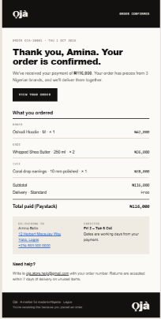

# Ọjà

Ọjà ("market" in Yoruba) is a curated online store for made-in-Nigeria brands. Shoppers browse
six independent brands and themed **edits**, fill one bag, sign in with Google and pay once with
**Paystack**. The order is saved in **Supabase** (Postgres) and a confirmation email is sent through
**Mailgun**. It was built for HNG Internship 15, Task 2, as a real, usable shop rather than a demo.

**Live:** <https://oja-store-seven.vercel.app>

Payments run in Paystack's **test mode**: no real money moves.

## What you can do

- Browse the **home page**, a **shop** with category, brand and sort filters, **six brand pages**
  (each in its own brand colours and type), and **product pages** with sizes and options.
- Read two **edits** ("The Owambe Edit", "The Harmattan Edit"): curated pieces from several brands
  with the curator's notes, and "Add all to bag".
- Fill a **bag** while signed out. It is kept in your browser, and when you sign in with Google it is
  merged into a bag saved to your account, so it follows you across devices.
- **Check out**: delivery details, Lagos or other-state delivery with the shop's fee rules, then pay
  on Paystack's page by card, bank transfer or USSD.
- See **Payment received** (or a clear "didn't go through" screen with "Try payment again"), get a
  **confirmation email**, and find the order under **Your orders**.
- Read the **privacy policy** and **terms** (delivery and a 7-day returns policy).

## Try it (for reviewers)

1. Open <https://oja-store-seven.vercel.app> and add a few pieces from different brands to your bag.
   Open the bag, then press **Checkout**.
2. Press **Continue with Google** and sign in with any Google account. You come back to checkout and
   your bag is still there.
3. Fill in the delivery details and press **Pay … with Paystack**.
4. Paystack's test-mode page shows the outcomes you can choose, so **no card details are needed**:
   - Choose **Success** and press **Pay** to complete the payment.
   - Choose **Declined** to see the "Payment didn't go through" screen. Closing Paystack's pop-up
     also ends there, and **Try payment again** starts a new attempt on the same order.
   - Choose **Bank Authentication** to see the extra verification step before a payment completes.
   - If you choose **Use another card**, use one of the cards in Paystack's official test-payments
     guide: <https://paystack.com/docs/payments/test-payments/>
5. You land on **Payment received**, with the order, the total and the expected delivery dates. The
   order is under **Your orders**, and the receipt email is sent (see the next section).

## Order confirmation emails

After a payment is confirmed, Ọjà emails the shopper a receipt through Mailgun.

**While the shop runs on Mailgun's sandbox domain, receipts only reach authorized recipients.**
Mailgun's sandbox refuses to deliver to any address that has not been added as an authorized
recipient in the Mailgun dashboard. If you place a test order with another address, the order
is still saved and paid, it shows under **Your orders**, and the payment screen says the receipt
could not be sent yet. A verified sending domain removes this limit.

**Sandbox receipts often land in spam, sometimes with an "unauthenticated" warning.** One of our
own test receipts did. The sandbox sends from a shared Mailgun address that is not set up for the
shop's own domain, so mail providers cannot confirm who the email is really from. Check the spam
folder if a receipt does not appear. For production, a **verified domain** (adding the SPF and DKIM
records Mailgun provides to the shop's own domain) fixes this, and so the warning and the
authorized-recipient limit go away together.

A real confirmation email, sent through Mailgun:



## How payments are verified

A browser redirect proves nothing, so Ọjà never trusts the page the shopper comes back to.

- **Prices, totals and stock come from the database.** Checkout builds the order from the
  server-side bag, the current variant prices and the delivery rules. Anything the browser sends
  about prices is ignored. Money is always an integer number of kobo.
- **An order is "paid" only after the server has confirmed it with Paystack**, either through the
  webhook (checked with an HMAC-SHA512 signature over the raw body) or through Paystack's Verify
  Transaction API. Both end in one function, `mark_paid()`.
- **Amount and currency are checked** against the order total before it is marked paid. A payment
  that does not match is logged and never marks the order paid.
- **Fulfilment is idempotent.** The order is claimed with one atomic `UPDATE ... WHERE
  status = 'pending_payment'`, so a webhook and a verify call arriving together, or the same webhook
  twice, take stock once, empty the bag once and send one email.
- **Stock never goes negative.** Each item is taken with `UPDATE ... WHERE stock >= quantity`. If
  there is not enough, the order is flagged for a person to handle.
- A failed payment or abandoned page leaves the order `pending_payment` and the bag intact, and
  "Try payment again" starts a new attempt (`OJA-10482-2`) on the same order.

Paystack's webhook is set to production only (`/api/paystack/webhook`). On localhost and Vercel
previews the verify call on return does the same job.

## Stack

| Part | Choice |
| --- | --- |
| Frontend | React 19, Vite 8, React Router 7, plain JavaScript and CSS (no framework) |
| Backend | FastAPI and SQLModel (Python), as one Vercel function |
| Database | Supabase Postgres in production, SQLite locally and in tests |
| Sign-in | Google through Supabase Auth; the backend verifies Supabase's signed tokens against its public keys |
| Payments | Paystack hosted checkout (redirect), test keys only |
| Email | Mailgun (sandbox domain) |
| Hosting | Vercel (London region) |

The browser talks to Supabase only for Google sign-in and the session. Every other piece of data
goes through the FastAPI backend, and the tables are not exposed through Supabase's Data API (Row
Level Security is on, with no public policies).

More detail is in [`ARCHITECTURE.md`](ARCHITECTURE.md), the product rules in [`PRD.md`](PRD.md), and
the look and copy rules in [`TASTE.md`](TASTE.md).

## Run it locally

You need Python 3.12 or newer and Node 20 or newer. These commands are for Windows PowerShell.

```powershell
python -m venv .venv
.venv\Scripts\activate
pip install -r requirements.txt -r requirements-dev.txt
python -m scripts.init_db        # create the tables and seed the catalogue (local SQLite by default)
uvicorn api.index:app --reload --port 8000 --env-file .env
```

In a second terminal:

```powershell
npm install
npm run dev                      # http://localhost:5173, /api is proxied to :8000
```

Copy `.env.example` to `.env` and fill in the values. Never commit `.env`. Anything starting with
`VITE_` is sent to every visitor's browser, so nothing secret may use that prefix.

| Name | What it is |
| --- | --- |
| `VITE_SUPABASE_URL`, `VITE_SUPABASE_PUBLISHABLE_KEY` | Supabase project address and publishable key (browser) |
| `SUPABASE_JWKS_URL` | The project's public signing keys, used to verify sign-in tokens |
| `DATABASE_URL` | Postgres connection (transaction pooler). Leave empty locally to use SQLite |
| `DATABASE_URL_SESSION` | Session pooler, used only by the seeding and reset scripts |
| `PAYSTACK_SECRET_KEY` | Paystack **test** secret key (also signs webhooks) |
| `MAILGUN_API_KEY`, `MAILGUN_DOMAIN`, `MAILGUN_API_BASE`, `MAILGUN_FROM` | Mailgun sending. `MAILGUN_FROM` looks like `Oja <orders@sandbox….mailgun.org>` |
| `APP_URL` | Where Paystack sends shoppers back to (production address, or `http://localhost:5173`) |
| `VITE_CONTACT_EMAIL` | Shown on the privacy, terms and email pages for help and returns |

To seed the live Supabase database, put the session-pooler string in `DATABASE_URL_SESSION` and run
`python -m scripts.init_db --supabase`. It upserts by slug and SKU, so it is safe to run twice, and it
never resets stock for variants that already exist.

For sign-in to work on a new address (localhost, a Vercel preview, production), that address must be
in Supabase's **Authentication, URL Configuration** redirect list.

## Test it

```powershell
pytest                           # the backend tests
npm run build                    # builds the frontend; fails on any error
```

The tests run against a temporary SQLite database with Paystack and Mailgun replaced by fakes, so
they never call a real service or touch Supabase. They cover every endpoint (success and each error
case), signature checks, price tampering, stock and idempotency, delivery rules, and that every
brand and edit colour pair meets WCAG AA contrast.

## Before submission: reset the test data

Test orders and test stock changes can be removed with a script that **only prints what it would do
unless you add `--apply`**:

```powershell
python -m scripts.reset_test_data                       # look at local SQLite (changes nothing)
python -m scripts.reset_test_data --supabase            # look at the live database (changes nothing)
python -m scripts.reset_test_data --supabase --apply    # do it on the live database
```

It removes every order and its items, the payment events and the saved bags, and puts the stock of
every catalogue variant back to its seed value. It keeps the catalogue and the saved profiles
(add `--profiles` to remove those too). Only run it on the live database when you mean to.

## What is not included

Out of scope for this deadline: brands managing their own products, payouts to brands, an admin
dashboard (products are managed in the Supabase dashboard), refund and return screens, delivery
tracking, reviews, wishlists, discount codes, full-text search, other currencies, and live Paystack
keys.

Known limits: delivery dates count working days (Monday to Friday) and do not skip public holidays;
receipts only reach authorized addresses while the shop is on Mailgun's sandbox; and an order that is
started but never paid stays as an unpaid order that is never listed and never touches stock.

## How AI was used

_This section is a factual draft, to be rewritten in the project owner's own words._

- The **planning, the feature and stack decisions, the design mockups and the project docs** (the
  PRD, architecture, style and taste documents, and the agent instructions) were done with
  **Claude Opus 5.5 on claude.ai**.
- The **build** was done with **Claude Sonnet 5.5 in Claude Code**, working from those docs and the
  mockups, one milestone at a time (M0 setup through M7 polish). Each milestone started with a plan
  and its decisions, and the **project owner approved each milestone** after checking it on a Vercel
  preview before it was merged. Commits made with Claude Code carry a co-author line.
- The rules the assistant worked under are in [`AGENTS.md`](AGENTS.md): money in integer kobo,
  never trusting the browser for prices or stock, an order is paid only after the server confirms
  it, no secrets in the repo, and no merged change without passing tests.
- Payments and sign-in were tested by the owner on the live previews with Paystack's test mode and a
  real Google account.
